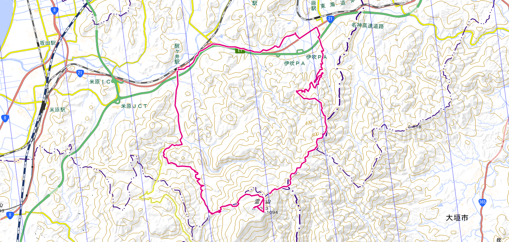

#### 更新履歴
- [x] v1.1 draft
- [ ] v1.2 日程決定(次回予定)

---
## 計画書
### 趣旨・目的

- 1,000m台とは思えぬほどの森林限界地帯、カルスト地形の広大な見通しを誇る同山で、異世界のような起伏ある平原に石が生える風景を楽しむ。テント泊ならではの夕暮れ時の黄昏、満天の星空、日の出と山紫の朝霧も堪能する。

| 項目     | 内容                            |
| :------- | :------------------------------ |
| 場所     | 滋賀県米原市/多賀町             |
| 概要     | カルスト地形の高原              |
| 歩行距離 | >>>>>>>>>> >> 長 (約25km/2日間) |
| 高低差   | >>>>>>>>>> 大 (計約950m)        |
| 予定時期 | 9月、テント泊(1泊)              |

### 参加者・連絡先

| 役割       | 名前     | 連絡先                 |
| :--------- | :------- | :--------------------- |
| （単独行） | member01 | Discord → finaldonguri |
|            |          |                        |
|            |          |                        |

### 行動計画

|      | 時刻  | アクション/ウェイポイント    |
| :--- | :---: | :--------------------------- |
| DAY1 | --:-- | JR桂川駅集合、出発(電車移動) |
|      | 10:00 | JR醒ヶ井駅到着、登山出発     |
|      | 11:00 | 醒ヶ井養鱒場到着             |
|      | 12:00 | 榑ヶ畑登山口到着             |
|      | 12:30 | 汗ふき峠到着（昼食）         |
|      | 15:00 | 霊仙山                       |
|      | 15:15 | 霊仙山最高点（C1）           |
|      | 17:00 | C1テント設営、夕食           |
|      | 20:00 | 就寝                         |
| DAY2 | 5:00  | 起床、朝食                   |
|      | 5:45  | C1撤収、出発                 |
|      | 7:30  | 柏原道四合目・避難小屋到着   |
|      | 11:00 | JR柏原駅到着、解散           |

#### 地域概念図

[国土地理院地形図(クリックで開きます)](https://maps.gsi.go.jp/#12/35.282762/136.393204/&base=std&ls=std&disp=1&vs=c1g1j0h0k0l0u0t0z0r0s0m0f1)

[ルート(クリックで開きます)](https://www.yamareco.com/modules/yamareco/detail-7253569.html)

### 食糧計画

|      | 食事   | 献立 | 材料 | 調理方法 |
| :--- | :----- | :--- | :--- | :------- |
| DAY1 | 昼食   | TBD  | TBD  | TBD      |
|      | 夕食   | TBD  | TBD  | TBD      |
| DAY2 | 朝食   | TBD  | TBD  | TBD      |
|      | 昼食   | TBD  | TBD  | TBD      |
| ALL  | 行動食 | TBD  | TBD  | TBD      |

熱中症・痙攣予防に塩分、ミネラル分を積極的に補給する。

### 医療計画
下記物品をファーストエイドボックス1個に入れる。

| 名称                   | 員数 | 1回量 | 有効成分                                    | 使い方                                                                         |
| :--------------------- | :--- | :---- | :------------------------------------------ | :----------------------------------------------------------------------------- |
| ムヒアルファSII        | 1    | 適量  | ｼﾞﾌｪﾝﾋﾄﾞﾗﾐﾝ塩酸塩,ﾃﾞｷｻﾒﾀｿﾞﾝ酢酸ｴｽﾃﾙ             | 虫さされのかゆみ・痛み・腫れをおさえる                                         |
| 新フジアロー           | 1    | 適量  | ｺﾙﾁｿﾞﾝ酢酸ｴｽﾃﾙ,ｸﾛﾙﾌｪﾆﾗﾐﾝﾏﾚｲﾝ酸塩,ｼﾞﾌﾞｶｲﾝ塩酸塩 | 副腎皮質ホルモン(ステロイド)と麻酔剤。強いかゆみを抑える                       | 副腎皮質ホルモン(ステロイド)。強いかゆみを抑える |
| アンテベート           | 1    | 適量  | ﾍﾞﾀﾒﾀｿﾞﾝ酪酸ｴｽﾃﾙﾌﾟﾛﾋﾟｵﾝ酸ｴｽﾃﾙ                   |
| クロマイ-N             | 1    | 適量  | ｸﾛﾗﾑﾌｪﾆｺｰﾙ,ﾌﾗｼﾞｵﾏｲｼﾝ硫酸塩                   | 細菌の繁殖をおさえ、化膿・とびひ・毛嚢炎、面疔を治す                           |
| テラ・コートリル       | 1    | 適量  | ｵｷｼﾃﾄﾗｻｲｸﾘﾝ塩酸塩,ﾋﾄﾞﾛｺﾙﾁｿﾞﾝ                  | 副腎皮質ホルモン(ステロイド)と抗菌剤。化膿しているあせもやかぶれ、虫刺されなど |
| 液体絆創膏(コロスキン) | 1    | 適量  | ピロキシリン                                | 擦り傷・切り傷の消毒・止血・化膿予防                                           |
| カロナール             | 4    | 1～2  | ｱｾﾄｱﾐﾉﾌｪﾝ                                   | あらゆる痛みをやわらげる。(子供もOK)                                           |
| ロキソニン             | 2    | 1     | ﾛｷｿﾌﾟﾛﾌｪﾝﾅﾄﾘｳﾑ                               | あらゆる痛みをやわらげる(大人だけ)                                             |
| 葛根湯                 | 4    | 1     | 葛根湯                                      | 風邪のひきはじめを吹き飛ばす。飲んだら寝ること(大人だけ)                       |
| 恵命我神散             | 1    | 1     | ガジュツ                                    | 胃の気持ち悪いのをやわらげる(子供は半分の量)                                   |
| ペラック               | 6    | 2     | ﾄﾗﾈｷｻﾑ酸                                    | 口やのどの痛み、はれなどの症状をやわらげる(7歳から)                            |
| ディレグラ             | 2    | 1     | ﾌｪｷｿﾌｪﾅｼﾞﾝ塩酸塩,塩酸ﾌﾟｿｲﾄﾞｴﾌｪﾄﾞﾘﾝ              | アレルギーによる花粉症や、じんましんをやわらげる                               |
| 消毒液                 | 1    | 適量  | ベンゼトニウム,アラントイン                 |                                                                                |
| ガーゼ                 | 1    | 適量  |                                             |                                                                                |
| サージカルテープ       | 1    |       |                                             |                                                                                |
| はさみ                 | 1    |       |                                             |                                                                                |
| ピンセット             | 1    |       |                                             |                                                                                |
| つめきり               | 1    |       |                                             |                                                                                |
| 綿棒                   | 5    |       |                                             |                                                                                |
| 絆創膏(ケアリーヴS)    | 10   |       |                                             |                                                                                |
| 絆創膏(ケアリーヴM)    | 10   |       |                                             |                                                                                |
| スピール膏             | 5    | 1     | サリチル酸                                  | 皮膚が固くなるイボやウオノメに使う                                             |

### 装備計画
チェックのないものを個人で用意してください。チェックの入ったものはこちらで人数分準備可能です。
- [ ] リュックサック
- [ ] 運動靴（底の厚いもの、防水性高いものを推奨。登山靴だと尚よい）
- [ ] 山着（ズボン、シャツ、厚めの靴下）
- [ ] 着替え（シャツ、靴下、下着など）
- [ ] 雨具（カッパ）上下
- [ ] タオル
- [ ] 昼食
- [ ] [水4L以上](https://www.yodobashi.com/product/100000001001864307/)（水場なし）
- [ ] 昼食（内容は**食糧計画**参照）
- [ ] サンダル（川で遊ぶなら）
- [ ] スマホ（[Geographica](https://geographica.biz/)をインストールし、山域地図の事前キャッシュを推奨）
- [ ] モバイルバッテリ＋ケーブル
- [ ] 食糧・行動食
- [x] 調理器具
- [x] ナイフ
- [x] 印刷した1/25,000 地形図
- [x] [コンパス](https://www.yodobashi.com/product/100000001001857090/)
- [x] ファーストエイドボックス（内容は**医療計画**参照）
  
### 気象
- 前日18時時点の[当該地域の天気予報](https://tenki.jp/forecast/6/28/6010/25206/)で降水確率**60%以上**であれば、中止または延期する。
- **装備計画**のとおり、降雨に備え、雨具（カッパ）上下、タオルを各自持参する。
- 行動中、周辺に積乱雲の顕著な発達を確認した場合は、[当該地域の雨雲レーダー](https://tenki.jp/radar/6/28/)などから降水帯の距離・移動方向及び速度を推定してパーティーが落雷・降雨・川の増水などの影響を受ける可能性を評価し、雨具着用や予定変更、ビバークなど適切な行動をとる。

### 記録体制
- スマホアプリ([Runkeeper](https://runkeeper.com/ja/)など)にて、GPXログを取得する。対象は上桐生登山口出発後、同地点帰着まで。昼食時などは測定停止可。
- 写真・動画撮影は自由に行う。

### その他
- [滋賀県熊出没マップ](https://www.google.com/maps/d/u/0/viewer?mid=1rE5HcSdJnm2gX3iT1FMt0aCVuQ9ArDs&ll=34.98091430000003%2C135.98476090000003&z=12)
- [クマ出没情報ブログ(滋賀県)](http://sukeroku.blog55.fc2.com/blog-category-52-1.html)

---

[EOF]

